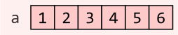
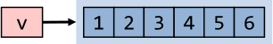
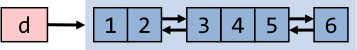
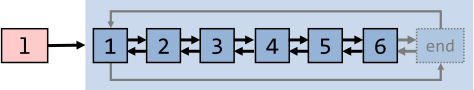
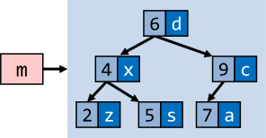
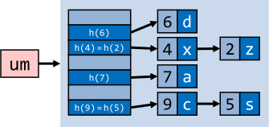
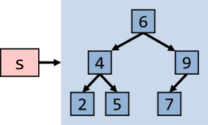
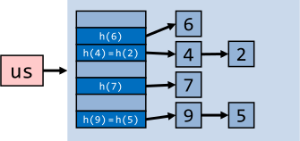

# C++ Notes

This repository contains personal notes on learning the C++ programming language. It covers a range of topics, including basic syntax, data types, and common functions and libraries. The notes are intended to serve as a reference for anyone looking to learn or brush up on their C++ skills.

## Initial Setup

```bash
# for Fedora
dnf install gcc-c++ gdb clang-tools-extra
```

## Quick Reference


### Data Types

```cpp

bool x = true;                                // 1 byte, values 0, 1
char a = 'a';                                 // 1 byte, values -127 to 127 or 0 to 255, usually 8 bit character
unsigned char b = 0xff;                       // 1 byte, values 0 to 255
signed char c = -1;                           // 1 byte, values -127 to 127
int d = 1234;                                 // 4 bytes, values -2147483648 to 2147483647
unsigned int e = 1;                           // 4 bytes, values 0 to 4294967295
signed int f = -127;                          // 4 bytes, values -2147483648 to 2147483647
short int g = -256;                           // 2 bytes, values -32768 to 32767
unsigned short int h = 65'535;                // 2 bytes, values 0 to 65,535
signed short int i = 32'767;                  // 2 bytes, values -32768 to 32767
long int j = 0xffffffffffffffL;               // 8 bytes, values -9223372036854775808 to 9223372036854775807
signed long int k = -0xffffffffffffff;        // 8 bytes, values -9223372036854775808 to 9223372036854775807
unsigned long int l = 0xffffffffffffffffUL;   // 8 bytes, values 0 to 18446744073709551615
long long int m = -0xfffffffffffffff;         // 8 bytes, values -(2^63) to (2^63)-1
unsigned long long int n = 0xfffffffffffffff; // 8 bytes, 0 to 18,446,744,073,709,551,615
float o = 2.5;                                // 4 bytes, single precision real (never unsigned)
double p = 3.14;                              // 8 bytes, double precision real (never unsigned)
long double q = 6.62607015e-34;               // 12 bytes
wchar_t r = L'ם';                             // 2 or 4 bytes, values 1 wide character

int8_t s = 0x7f;                              // 1 byte, values -127 to 127
int16_t t = 0x7fff;                           // 2 bytes, values -32768 to 32767
int32_t u = 0x7fffffff;                       // 4 bytes, values -2147483648 to 2147483647
int64_t v = 0x7fffffffffffffff;               // 8 bytes, values -9223372036854775808 to 9223372036854775807

uint8_t us = 0xff;                            // 1 byte, values 0 to 255
uint16_t ut = 0xffff;                         // 2 bytes, values 0 to 65,535
uint32_t uu = 0xffffffff;                     // 4 bytes, values 0 to 4294967295
uint64_t uv = 0xffffffffffffffff;             // 8 bytes, values 0 to 18446744073709551615

```

### Preprocessor

```cpp
                            // Comment to end of line
                            /* Multi-line comment */
#include  <stdio.h>         // Insert standard header file
#include "myfile.h"         // Insert file in current directory
#define X some text         // Replace X with some text
#define F(a,b) a+b          // Replace F(1,2) with 1+2
#define X \
 some text                  // Multiline definition
#undef X                    // Remove definition
#if defined(X)              // Conditional compilation (#ifdef X)
#else                       // Optional (#ifndef X or #if !defined(X))
#endif                      // Required after #if, #ifdef
```

### Literals

```cpp
255, 0377, 0xff             // Integers (decimal, octal, hex)
2147483647L, 0x7fffffffl    // Long (32-bit) integers
123.0, 1.23e2               // double (real) numbers
'a', '\141', '\x61'         // Character (literal, octal, hex)
'\n', '\\', '\'', '\"'      // Newline, backslash, single quote, double quote
"string\n"                  // Array of characters ending with newline and \0
"hello" "world"             // Concatenated strings
true, false                 // bool constants 1 and 0
nullptr                     // Pointer type with the address of 0
```


### Declarations

```cpp
int x;                              // Declare x to be an integer (value undefined)
int x=255;                          // Declare and initialize x to 255
short s; long l;                    // Usually 16 or 32 bit integer (int may be either)
char c='a';                         // Usually 8 bit character
unsigned char u=255;
signed char s=-1;                   // char might be either
unsigned long x = 0xffffffffL;      // short, int, long are signed
float f; double d;                  // Single or double precision real (never unsigned)
bool b=true;                        // true or false, may also use int (1 or 0)
int a, b, c;                        // Multiple declarations
int a[10];                          // Array of 10 ints (a[0] through a[9])
int a[]={0,1,2};                    // Initialized array (or a[3]={0,1,2}; )
int a[2][2]={{1,2},{4,5}};          // Array of array of ints
char s[]="hello";                   // String (6 elements including '\0')
std::string s = "Hello"             // Creates string object with value "Hello"
std::string s = R"(Hello
World)";                            // Creates string object with value "Hello\nWorld"
int* p;                             // p is a pointer to (address of) int
char* s="hello";                    // s points to unnamed array containing "hello"
void* p=nullptr;                    // Address of untyped memory (nullptr is 0)
int& r=x;                           // r is a reference to (alias of) int x
enum weekend {SAT,SUN};             // weekend is a type with values SAT and SUN
enum weekend day;                   // day is a variable of type weekend
enum weekend{SAT=0,SUN=1};          // Explicit representation as int
enum {SAT,SUN} day;                 // Anonymous enum
enum class Color {Red,Blue};        // Color is a strict type with values Red and Blue
Color x = Color::Red;               // Assign Color x to red
typedef String char*;               // String s; means char* s;
const int c=3;                      // Constants must be initialized, cannot assign to
const int* p=a;                     // Contents of p (elements of a) are constant
int* const p=a;                     // p (but not contents) are constant
const int* const p=a;               // Both p and its contents are constant
const int& cr=x;                    // cr cannot be assigned to change x
int8_t,uint8_t,int16_t,
uint16_t,int32_t,uint32_t,
int64_t,uint64_t                    // Fixed length standard types
auto it = m.begin();                // Declares it to the result of m.begin()
auto const param = config["param"]; // Declares it to the const result
auto& s = singleton::instance();    // Declares it to a reference of the result
```

### STORAGE Classes

```cpp
int x;                      // Auto (memory exists only while in scope)
static int x;               // Global lifetime even if local scope
extern int x;               // Information only, declared elsewhere
```

### Statements

```cpp
x=y;                        // Every expression is a statement
int x;                      // Declarations are statements
;                           // Empty statement

{                           // A block is a single statement
    int x;                  // Scope of x is from declaration to end of block
}

if (x) a;                   // If x is true (not 0), evaluate a
else if (y) b;              // If not x and y (optional, may be repeated)
else c;                     // If not x and not y (optional)

while (x) a;                // Repeat 0 or more times while x is true

for (x; y; z) a;            // Equivalent to: x; while(y) {a; z;}

for (x : y) a;              // Range-based for loop e.g.
                            // for (auto& x in someList) x.y();

do a; while (x);            // Equivalent to: a; while(x) a;

switch (x) {                // x must be int
    case X1: a;             // If x == X1 (must be a const), jump here
    case X2: b;             // Else if x == X2, jump here
    default: c;             // Else jump here (optional)
}

break;                      // Jump out of while, do, or for loop, or switch
continue;                   // Jump to bottom of while, do, or for loop
return x;                   // Return x from function to caller
try { a; }
catch (T t) { b; }          // If a throws a T, then jump here
catch (...) { c; }          // If a throws something else, jump here
```

### Functions

```cpp
int f(int x, int y);        // f is a function taking 2 ints and returning int
void f();                   // f is a procedure taking no arguments
void f(int a=0);            // f() is equivalent to f(0)
f();                        // Default return type is int
inline f();                 // Optimize for speed
f() { statements; }         // Function definition (must be global)
T operator+(T x, T y);      // a+b (if type T) calls operator+(a, b)
T operator-(T x);           // -a calls function operator-(a)
T operator++(int);          // postfix ++ or -- (parameter ignored)
extern "C" {void f();}      // f() was compiled in C
```

### Expressions

```cpp
T::X                        // Name X defined in class T
N::X                        // Name X defined in namespace N
::X                         // Global name X

t.x                         // Member x of struct or class t
p-> x                       // Member x of struct or class pointed to by p
a[i]                        // i'th element of array a
f(x,y)                      // Call to function f with arguments x and y
T(x,y)                      // Object of class T initialized with x and y
x++                         // Add 1 to x, evaluates to original x (postfix)
x--                         // Subtract 1 from x, evaluates to original x
typeid(x)                   // Type of x
typeid(T)                   // Equals typeid(x) if x is a T
dynamic_cast< T>(x)         // Converts x to a T, checked at run time.
static_cast< T>(x)          // Converts x to a T, not checked
reinterpret_cast< T>(x)     // Interpret bits of x as a T
const_cast< T>(x)           // Converts x to same type T but not const

sizeof x                    // Number of bytes used to represent object x
sizeof(T)                   // Number of bytes to represent type T
++x                         // Add 1 to x, evaluates to new value (prefix)
--x                         // Subtract 1 from x, evaluates to new value
~x                          // Bitwise complement of x
!x                          // true if x is 0, else false (1 or 0 in C)
-x                          // Unary minus
+x                          // Unary plus (default)
&x                          // Address of x
*p                          // Contents of address p (*&x equals x)
new T                       // Address of newly allocated T object
new T(x, y)                 // Address of a T initialized with x, y
new T[x]                    // Address of allocated n-element array of T
delete p                    // Destroy and free object at address p
delete[] p                  // Destroy and free array of objects at p
(T) x                       // Convert x to T (obsolete, use .._cast<T>(x))

x * y                       // Multiply
x / y                       // Divide (integers round toward 0)
x % y                       // Modulo (result has sign of x)

x + y                       // Add, or \&x[y]
x - y                       // Subtract, or number of elements from *x to *y
x << y                      // x shifted y bits to left (x * pow(2, y))
x >> y                      // x shifted y bits to right (x / pow(2, y))

x < y                       // Less than
x <= y                      // Less than or equal to
x > y                       // Greater than
x >= y                      // Greater than or equal to

x & y                       // Bitwise and (3 & 6 is 2)
x ^ y                       // Bitwise exclusive or (3 ^ 6 is 5)
x | y                       // Bitwise or (3 | 6 is 7)
x && y                      // x and then y (evaluates y only if x (not 0))
x || y                      // x or else y (evaluates y only if x is false (0))
x = y                       // Assign y to x, returns new value of x
x += y                      // x = x + y, also -= *= /= <<= >>= &= |= ^=
x ? y : z                   // y if x is true (nonzero), else z
throw x                     // Throw exception, aborts if not caught
x , y                       // evaluates x and y, returns y (seldom used)
```

### Classes

```cpp

class T {                       // A new type
private:                        // Section accessible only to T's member functions
protected:                      // Also accessible to classes derived from T
public:                         // Accessible to all
    int x;                      // Member data
    void f();                   // Member function
    void g() {return;}          // Inline member function
    void h() const;             // Does not modify any data members
    int operator+(int y);       // t+y means t.operator+(y)
    int operator-();            // -t means t.operator-()
    T(): x(1) {}                // Constructor with initialization list
    T(const T& t): x(t.x) {}    // Copy constructor
    T& operator=(const T& t)
    {x=t.x; return *this; }     // Assignment operator
    ~T();                       // Destructor (automatic cleanup routine)
    explicit T(int a);          // Allow t=T(3) but not t=3
    T(float x): T((int)x) {}    // Delegate constructor to T(int)
    operator int() const
    {return x;}                 // Allows int(t)
    friend void i();            // Global function i() has private access
    friend class U;             // Members of class U have private access
    static int y;               // Data shared by all T objects
    static void l();            // Shared code.  May access y but not x
    class Z {};                 // Nested class T::Z
    typedef int V;              // T::V means int
};
void T::f() {                   // Code for member function f of class T
    this->x = x;}               // this is address of self (means x=x;)
int T::y = 2;                   // Initialization of static member (required)
T::l();                         // Call to static member
T t;                            // Create object t implicit call constructor
t.f();                          // Call method f on object t

struct T {                      // Equivalent to: class T { public:
  virtual void i();             // May be overridden at run time by derived class
  virtual void g()=0; };        // Must be overridden (pure virtual)
class U: public T {             // Derived class U inherits all members of base T
  public:
  void g(int) override; };      // Override method g
class V: private T {};          // Inherited members of T become private
class W: public T, public U {}; // Multiple inheritance
class X: public virtual T {};   // Classes derived from X have base T directly
```

All classes have a default copy constructor, assignment operator, and destructor, which perform the corresponding operations on each data member and each base class as shown above. There is also a default no-argument constructor (required to create arrays) if the class has no constructors. Constructors, assignment, and destructors do not inherit.

### Templates

```cpp
template <class T> T f(T t);    // Overload f for all types
template <class T> class X {    // Class with type parameter T
  X(T t); };                    // A constructor
template <class T> X<T>::X(T t) {}
                                // Definition of constructor
X<int> x(3);                    // An object of type "X of int"
template <class T, class U=T, int n=0>
                                // Template with default parameters
```

### Namespaces


```cpp
namespace N {class T {};}   // Hide name T
N::T t;                     // Use name T in namespace N
using namespace N;          // Make T visible without N::
```

### `memory`

Dynamic memory management.

```cpp
#include <memory>                   // Include memory (std namespace)
shared_ptr<int> x;                  // Empty shared_ptr to a integer on heap. Uses reference counting for cleaning up objects.
x = make_shared<int>(12);           // Allocate value 12 on heap
shared_ptr<int> y = x;              // Copy shared_ptr, implicit changes reference count to 2.
cout << *y;                         // Dereference y to print '12'
if (y.get() == x.get()) {           // Raw pointers (here x == y)
    cout << "Same";  
}  
y.reset();                          // Eliminate one owner of object
if (y.get() != x.get()) { 
    cout << "Different";  
}  
if (y == nullptr) {                 // Can compare against nullptr (here returns true)
    cout << "Empty";  
}  
y = make_shared<int>(15);           // Assign new value
cout << *y;                         // Dereference x to print '15'
cout << *x;                         // Dereference x to print '12'
weak_ptr<int> w;                    // Create empty weak pointer
w = y;                              // w has weak reference to y.
if (shared_ptr<int> s = w.lock()) { // Has to be copied into a shared_ptr before usage
    cout << *s;
}
unique_ptr<int> z;                  // Create empty unique pointers
unique_ptr<int> q;
z = make_unique<int>(16);           // Allocate int (16) on heap. Only one reference allowed.
q = move(z);                        // Move reference from z to q.
if (z == nullptr){
    cout << "Z null";
}
cout << *q;
shared_ptr<B> r;
r = dynamic_pointer_cast<B>(t);     // Converts t to a shared_ptr<B>
```

### `string`

Variable sized character array.

```cpp
#include <string>           // Include string (std namespace)
string s1, s2="hello";      // Create strings
s1.size(), s2.size();       // Number of characters: 0, 5
s1 += s2 + ' ' + "world";   // Concatenation
s1 == "hello world"         // Comparison, also <, >, !=, etc.
s1[0];                      // 'h'
s1.substr(m, n);            // Substring of size n starting at s1[m]
s1.c_str();                 // Convert to const char*
s1 = to_string(12.05);      // Converts number to string
getline(cin, s);            // Read line ending in '\n'
```

### `array`



Fixed-size contiguous array with overhead-free random access.
Excels in fast traversal and good for linear searches.
`size` has to be a constant expression (= known at compile time).
Does not support size-changing operations (resize, insert, erase, …).
Potentially slow if element type has high copy/assignment cost (reordering elements requires copying/moving them)

```cpp
#include <array>        // Include vector (std namespace)
std::array<int,6> a {4,8,15,16,23,42};
                        // Create array with values 4,8,15,16..
a.size();               // Number of elements (6)
a[0];                   // 4
a[3];                   // 16
a.front();              // 4
a.back();               // 42

```

### `vector`




[Cheat sheet](https://hackingcpp.com/cpp/std/vector.png)

Dynamic contiguous array/stack with built in memory allocation.
Amortized O(1) growth strategy.
C++'s default container.

```cpp
#include <vector>           // Include vector (std namespace)
vector<int> a(10);          // a[0]..a[9] are int (default size is 0)
vector<int> b{1,2,3};       // Create vector with values 1,2,3
a.size();                   // Number of elements (10)
a.push_back(3);             // Increase size to 11, a[10]=3
a.back()=4;                 // a[10]=4;
a.pop_back();               // Decrease size by 1
a.front();                  // a[0];
a[20]=1;                    // Crash: not bounds checked
a.at(20)=1;                 // Like a[20] but throws out_of_range()
for (int& p : a)
  p=0;                      // C++11: Set all elements of a to 0
for (vector<int>::iterator p=a.begin(); p!=a.end(); ++p)
  *p=0;                     // C++03: Set all elements of a to 0
vector<int> b(a.begin(), a.end());  // b is copy of a
vector<T> c(n, x);          // c[0]..c[n-1] init to x
T d[10]; vector<T> e(d, d+10);      // e is initialized from d
```

### `deque` Double Ended Queue



[Cheat sheet](https://hackingcpp.com/cpp/std/deque.png)

Constant-time random access (extremely small overhead).
Good insertion and deletion performance at both ends.


`deque<T>` is like `vector<T>`, but also supports:

```cpp
#include <deque>          // Include deque (std namespace)
a.push_front(x);          // Puts x at a[0], shifts elements toward back
a.pop_front();            // Removes a[0], shifts toward front
```

### `list` Doubly-linked List



[Cheat sheet](https://hackingcpp.com/cpp/std/list.png)

Doubly-linked list; O(1) insert, erase & splicing;
in practice often slower than vector.
Restructuring operations don't require elements to be moved/copied (good for storing large objects with high copy/assignment cost).
Constant-time splicing (of complete lists).


```cpp
#include <list>                 // Include list (std namespace)
std::list<int> l {3};
l.push_back(2);                 // Adds a new element ‘2’ at the end of the list
l.push_front(4);                // Adds a new element ‘4’ at the beginning of the list
l.splice(begin(l)+1,
         list<int>{8, 4, 7});   // Used to transfer elements from one list to another
l.reverse();                    // Reverses the list
l.sort();                       // Sorts the list in increasing order
l.unique();                     // Removes all duplicate consecutive elements from the list
```

### `forward_list` Singly-linked List

]

[Cheat sheet](https://hackingcpp.com/cpp/std/forward_list.png)


Singly-linked list; `O(1)` insert, erase & splicing; needs less memory than list; in practice often slower than vector.

```cpp
#include <forward_list>                 // Include list (std namespace)
std::forward_list<int> l {23,42,4};     // Create list with values 23,42,4

l.insert_after(begin(l), 5);            // Puts values into second position overwriting 42
l.insert_after(before_begin(l), 88);    // Puts value in the first position overwriting 23
l.erase_after(begin(l));                // Removes second element
```


### `utility` (pair)

```cpp
#include <utility>        // Include utility (std namespace)
pair<string, int> a("hello", 7);  // A 2-element struct
a.first;                  // "hello"
a.second;                 // 7
```

### `map`



[Cheat sheet](https://hackingcpp.com/cpp/std/map.png)

Associative array usually implemented as binary search trees - avg. time complexity: `O(log n)`.

```cpp
#include <map>            // Include map (std namespace)
map<string, int> a;       // Map from string to int
a["hello"] = 3;           // Add or replace element a["hello"]
for (auto& p:a)
    cout << p.first << p.second;  // Prints hello, 3
a.size();                 // 1
```

### `unordered_map`



[Cheat sheet](https://hackingcpp.com/cpp/std/unordered_map.png)

Associative array usually implemented as hash table - avg. time complexity: `O(1)`

```cpp
#include <unordered_map>        // Include map (std namespace)
unordered_map<string, int> a;   // Map from string to int
a["hello"] = 3;                 // Add or replace element a["hello"]
for (auto& p:a)
    cout << p.first << p.second;  // Prints hello, 3
a.size();                       // 1
```

### `set` Ordered Sets 



[Cheat sheet](https://hackingcpp.com/cpp/std/set.png)

Store unique elements - usually implemented as binary search trees - avg. time complexity: `O(log n)`

```cpp
#include <set>            // Include set (std namespace)
set<int> s;               // Set of integers
s.insert(123);            // Add element to set
if (s.find(123) != s.end()) // Search for an element
    s.erase(123);
cout << s.size();         // Number of elements in set
```


### `unordered_set`



[Cheat sheet](https://hackingcpp.com/cpp/std/unordered_set.png)

Store unique elements - usually implemented as a hash set - avg. time complexity: `O(1)`

```cpp
#include <unordered_set>  // Include set (std namespace)
unordered_set<int> s;     // Set of integers
s.insert(123);            // Add element to set
if (s.find(123) != s.end()) // Search for an element
    s.erase(123);
cout << s.size();         // Number of elements in set
```

### `math.h`, `cmath`

Floating point math.

```cpp
#include <cmath>                // Include cmath (std namespace)
sin(x); cos(x); tan(x);         // Trig functions, x (double) is in radians
asin(x); acos(x); atan(x);      // Inverses
atan2(y, x);                    // atan(y/x)
sinh(x); cosh(x); tanh(x);      // Hyperbolic sin, cos, tan functions
exp(x); log(x); log10(x);       // e to the x, log base e, log base 10
pow(x, y); sqrt(x);             // x to the y, square root
ceil(x); floor(x);              // Round up or down (as a double)
fabs(x); fmod(x, y);            // Absolute value, x mod y
```

### `assert.h`, `cassert`

Debugging aid.

```cpp
#include <cassert>        // Include iostream (std namespace)
assert(e);                // If e is false, print message and abort
#define NDEBUG            // (before #include <assert.h>), turn off assert
```

### `iostream.h`, `iostream`

Replaces stdio.h.

```cpp
#include <iostream>         // Include iostream (std namespace)
cin >> x >> y;              // Read words x and y (any type) from stdin
cout << "x=" << 3 << endl;  // Write line to stdout
cerr << x << y << flush;    // Write to stderr and flush
c = cin.get();              // c = getchar();
cin.get(c);                 // Read char
cin.getline(s, n, '\n');    // Read line into char s[n] to '\n' (default)
if (cin)                    // Good state (not EOF)?
                            // To read/write any type T:
istream& operator>>(istream& i, T& x) {i >> ...; x=...; return i;}
ostream& operator<<(ostream& o, const T& x) {return o << ...;}
```

### `fstream.h`, `fstream`

File I/O works like cin, cout as above.

```cpp
#include <fstream>          // Include filestream (std namespace)
ifstream f1("filename");    // Open text file for reading
if (f1)                     // Test if open and input available
    f1 >> x;                // Read object from file
f1.get(s);                  // Read char or line
f1.getline(s, n);           // Read line into string s[n]
ofstream f2("filename");    // Open file for writing
if (f2) f2 << x;            // Write to file
```

### `algorithm`

A collection of 60 algorithms on sequences with iterators

```cpp
#include <algorithm>            // Include algorithm (std namespace)
min(x, y); max(x, y);           // Smaller/larger of x, y (any type defining <)
swap(x, y);                     // Exchange values of variables x and y
sort(a, a+n);                   // Sort array a[0]..a[n-1] by <
sort(a.begin(), a.end());       // Sort vector or deque
reverse(a.begin(), a.end());    // Reverse vector or deque
```

### `chrono`

Time related library.

```cpp
#include <chrono>         // Include chrono
using namespace std::chrono; // Use namespace
auto from =               // Get current time_point
  high_resolution_clock::now();
// ... do some work       
auto to =                 // Get current time_point
  high_resolution_clock::now();
using ms =                // Define ms as floating point duration
  duration<float, milliseconds::period>;
                          // Compute duration in milliseconds
cout << duration_cast<ms>(to - from)
  .count() << "ms";
```

### `thread`

Multi-threading library.

```cpp
#include <thread>         // Include thread
unsigned c = 
  hardware_concurrency(); // Hardware threads (or 0 for unknown)
auto lambdaFn = [](){     // Lambda function used for thread body
    cout << "Hello multithreading";
};
thread t(lambdaFn);       // Create and run thread with lambda
t.join();                 // Wait for t finishes

// --- shared resource example ---
mutex mut;                         // Mutex for synchronization
condition_variable cond;           // Shared condition variable
const char* sharedMes              // Shared resource
  = nullptr;
auto pingPongFn =                  // thread body (lambda). Print someone else's message
  [&](const char* mes){
    while (true){
      unique_lock<mutex> lock(mut);// locks the mutex 
      do {                
        cond.wait(lock, [&](){     // wait for condition to be true (unlocks while waiting which allows other threads to modify)        
          return sharedMes != mes; // statement for when to continue
        });
      } while (sharedMes == mes);  // prevents spurious wakeup
      cout << sharedMes << endl;
      sharedMes = mes;       
      lock.unlock();               // no need to have lock on notify 
      cond.notify_all();           // notify all condition has changed
    }
  };
sharedMes = "ping";
thread t1(pingPongFn, sharedMes);  // start example with 3 concurrent threads
thread t2(pingPongFn, "pong");
thread t3(pingPongFn, "boing");
```

### `future`

Thread support library.

```cpp
#include <future>         // Include future
function<int(int)> fib =  // Create lambda function
  [&](int i){
    if (i <= 1){
      return 1;
    }
    return fib(i-1) 
         + fib(i-2);
  };
future<int> fut =         // result of async function
  async(launch::async, fib, 4); // start async function in other thread
// do some other work 
cout << fut.get();        // get result of async function. Wait if needed.
```

---

## References

- [📺️ C++ Tutorial for Beginners - Learn C++ in 1 Hour](https://www.youtube.com/watch?v=ZzaPdXTrSb8)
- [Using C++ on Linux in VS Code](https://code.visualstudio.com/docs/cpp/config-linux)
- [Visual Studio Code C++ December 2021 Update: clang-tidy](https://devblogs.microsoft.com/cppblog/visual-studio-code-c-december-2021-update-clang-tidy/)
- [Google C++ Style Guide](https://google.github.io/styleguide/cppguide.html)
- [Google C++ Style Guide [with code highlight]](./google-style-guide.html)
- [Bjarne Stroustrup's C++ Style and Technique FAQ](https://www.stroustrup.com/bs_faq2.html)
- [STL Algorithms](https://www.cs.helsinki.fi/u/tpkarkka/alglib/k06/lectures/algorithms.html)
- [mortennobel/cpp-Cheat sheet](https://github.com/mortennobel/cpp-Cheatsheet)
- [C++ Cheat Sheets & Infographics](https://hackingcpp.com/cpp/cheat_sheets.html)
- [CMake Tutorial](https://cmake.org/cmake/help/latest/guide/tutorial/A%20Basic%20Starting%20Point.html)
- [📑 C++ Beginner's Guide](https://hackingcpp.com/cpp/beginners_guide.html#intro)